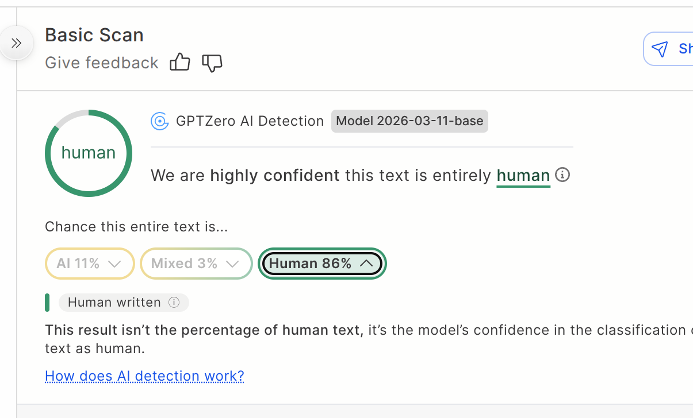
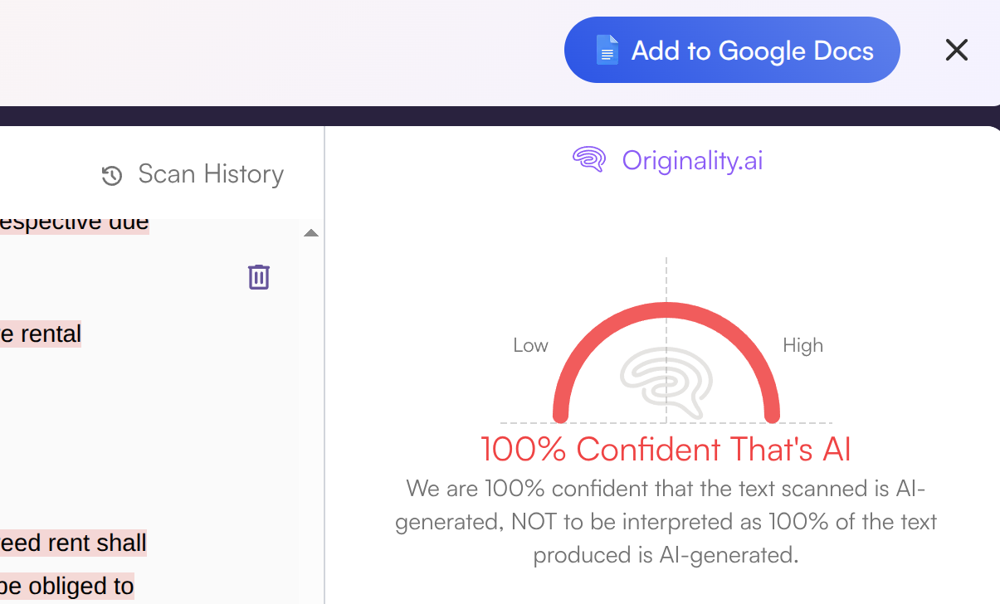

# Popular tools for detection of Machine-Generated Text

## GPTZero

### Addressed Problems

GPTZero addresses the authorship attribution problem:

- Distinguishing human-written vs AI-generated text
- Detecting partial AI assistance

### Methods

Top level idea:

- Perplexity: how “surprising” the text is to a language model
- Burstiness: variation in sentence structure

More specifically it is based on supervised model (elements of NLP + deep learning) trained on:
- large-scale human text
- large-scale AI-generated text
- adversarially modified text

### Quality Measures

- In-house metrics
- RAID benchmark

### Disadvantages

While good for AI text detection, it has very hight false-positive rate on
human texts: [paper](https://arxiv.org/pdf/2506.23517)

### UI Idea

<!-- --------------------------------------------------------------------------- -->

## Originality.AI

### Addressed Problems

Originality.AI addresses trust and authenticity of text content:

- Distinguishing human-written vs AI-generated text
- Detecting partial AI assistance
- Plagiarism + factual reliability

### Methods

In-house supervised model (elements of NLP + deep learning).

### Quality Measures

- In-house metrics
- RAID benchmark

<!-- --------------------------------------------------------------------------- -->

## GLTR

### Addressed Problems

GLTR focuses on AI text detection:

- Distinguishing human-written vs AI-generated text

### Methods

GPT-2-based model for predicting probabilities of words as it traces text.

### Quality Measures

- Human-in-the-loop Accuracy: One of the biggest findings in the GLTR
  paper was that humans are bad at spotting AI text alone,
  but their accuracy jumped from 54% to 72%

- ROC AUC

<!-- --------------------------------------------------------------------------- -->

## Binoculars

### Addressed Problems

Binoculars focuses on AI text detection:

- Distinguishing human-written vs AI-generated text

### Methods

Variant of a contrastive method. uses two pre-trained LLMs.
- One **observer** model computes the log perplexity .
- Second **performer** model generates next-token predictions,
  and the observer then evaluates those predictions via
  cross-perplexity.

### Quality Measures

- False Positive Rate
- True Positive Rate

### Disadvantages

Needs to have open LLMs.

